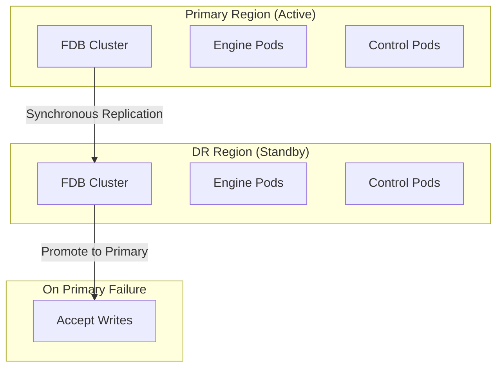

# Disaster Recovery Guide

This guide covers disaster recovery procedures for InferaDB deployments using FoundationDB Fearless DR.

## Overview

InferaDB's disaster recovery is built on FoundationDB's native multi-region replication. When properly configured, the system provides:

- **RPO (Recovery Point Objective)**: Near-zero (synchronous replication)
- **RTO (Recovery Time Objective)**: < 60 seconds for automatic failover

## Architecture



## Pre-Requisites

Before a disaster occurs, ensure:

1. **Multi-region FDB deployed** - See [foundationdb-multi-region.md](./foundationdb-multi-region.md)
2. **Tailscale mesh configured** - See [tailscale-multi-region.md](./tailscale-multi-region.md)
3. **Monitoring in place** - Alerts for replication lag and availability
4. **Runbooks documented** - Team knows recovery procedures

## Failure Scenarios

### Scenario 1: Single Pod Failure

**Impact**: Minimal - Kubernetes handles automatically

**Recovery**: Automatic pod restart via Deployment/StatefulSet

```bash
# Verify pod recovery
kubectl get pods -n inferadb -w
```

### Scenario 2: Single Node Failure

**Impact**: Temporary capacity reduction

**Recovery**:

1. Kubernetes reschedules pods to healthy nodes
2. FDB redistributes data automatically

```bash
# Check FDB status
kubectl exec -it inferadb-fdb-storage-0 -n inferadb -c foundationdb -- fdbcli --exec "status"
```

### Scenario 3: Availability Zone Failure

**Impact**: Reduced redundancy within region

**Recovery**:

1. Pods reschedule to surviving AZs
2. FDB maintains quorum if majority survives

```bash
# Check node distribution
kubectl get pods -n inferadb -o wide
```

### Scenario 4: Full Region Failure

**Impact**: Primary region unavailable

**Recovery**: DR region promotion (see below)

## DR Region Promotion

### Automatic Failover

FDB Fearless DR handles most failures automatically:

1. Primary region becomes unavailable
2. DR coordinators detect quorum loss
3. DR region promoted to primary (typically < 60 seconds)
4. Applications reconnect to DR endpoints

**Monitor for automatic failover:**

```bash
# Watch FDB status in DR region
kubectl exec -it inferadb-fdb-storage-0 -n inferadb -c foundationdb \
  --context eks-dr -- fdbcli --exec "status"
```

### Manual Failover

Use manual failover when:

- Automatic failover hasn't triggered
- You need to force promotion for testing
- Primary is partially available but degraded

```bash
# Force DR promotion (may lose uncommitted transactions)
kubectl exec -it inferadb-fdb-storage-0 -n inferadb -c foundationdb \
  --context eks-dr -- fdbcli --exec "force_recovery_with_data_loss"
```

**Warning**: `force_recovery_with_data_loss` may result in data loss if the primary has uncommitted transactions.

### Post-Failover Steps

1. **Verify DR is primary:**

   ```bash
   kubectl exec -it inferadb-fdb-storage-0 -n inferadb -c foundationdb \
     --context eks-dr -- fdbcli --exec "status"
   # Should show "Healthy" and accepting writes
   ```

2. **Update DNS/Load Balancer** (if not automatic):

   ```bash
   # Update Route53 health checks or similar
   aws route53 update-health-check --health-check-id <id> --regions eu-west-1
   ```

3. **Notify stakeholders** via incident management system

4. **Document the incident** for post-mortem

## Failback Procedure

After the original primary recovers:

### Step 1: Verify Original Primary Health

```bash
# Check infrastructure is healthy
kubectl get nodes --context eks-primary
kubectl get pods -n inferadb --context eks-primary
```

### Step 2: Re-sync Data

The original primary automatically re-syncs from current primary:

```bash
# Monitor sync progress
kubectl exec -it inferadb-fdb-storage-0 -n inferadb -c foundationdb \
  --context eks-primary -- fdbcli --exec "status details"
```

Wait for "Fully replicated" status.

### Step 3: Optional Promotion Back

If you want the original region as primary:

```bash
# Promote original region back to primary
kubectl exec -it inferadb-fdb-storage-0 -n inferadb -c foundationdb \
  --context eks-primary -- fdbcli --exec "force_recovery_with_data_loss"
```

**Note**: Only do this during a maintenance window.

## Testing DR

### Monthly DR Drills

1. **Schedule maintenance window**
2. **Notify stakeholders**
3. **Simulate primary failure:**

   ```bash
   # Scale down primary FDB
   kubectl scale statefulset inferadb-fdb-storage --replicas=0 \
     -n inferadb --context eks-primary
   ```

4. **Verify DR promotion** (should happen within 60s)
5. **Test application connectivity** to DR region
6. **Restore primary:**

   ```bash
   kubectl scale statefulset inferadb-fdb-storage --replicas=3 \
     -n inferadb --context eks-primary
   ```

7. **Document results** in `deploy/dr-drill-results/`

### Automated DR Testing

Consider implementing automated DR testing in CI/CD:

```yaml
# Example GitHub Actions workflow
name: DR Drill
on:
  schedule:
    - cron: "0 3 1 * *" # Monthly at 3 AM

jobs:
  dr-drill:
    runs-on: ubuntu-latest
    steps:
      - name: Trigger DR failover
        run: ./scripts/dr-drill.sh
      - name: Verify DR health
        run: ./scripts/verify-dr-health.sh
      - name: Restore primary
        run: ./scripts/restore-primary.sh
```

## Monitoring and Alerts

### Key Metrics

| Metric                        | Alert Threshold | Action                   |
| ----------------------------- | --------------- | ------------------------ |
| `fdb_database_available`      | == 0            | Page on-call             |
| `fdb_replication_lag_seconds` | > 5s            | Investigate network      |
| `fdb_coordinators_connected`  | < 3             | Check coordinator health |

### Alert Examples

```yaml
# Prometheus alert rules
groups:
  - name: inferadb-dr
    rules:
      - alert: FDBReplicationLagHigh
        expr: fdb_replication_lag_seconds > 5
        for: 2m
        labels:
          severity: warning
        annotations:
          summary: "FDB replication lag is high"

      - alert: FDBUnavailable
        expr: fdb_database_available == 0
        for: 30s
        labels:
          severity: critical
        annotations:
          summary: "FDB database unavailable - DR may be needed"
```

## Backup and Restore

While FDB Fearless DR handles real-time replication, maintain backups for:

- Point-in-time recovery
- Corruption recovery
- Compliance requirements

### FDB Backup

```bash
# Start continuous backup
fdbbackup start -d file:///backup/inferadb -z

# Check backup status
fdbbackup status -d file:///backup/inferadb
```

### Restore from Backup

```bash
# Restore to new cluster
fdbrestore start -r file:///backup/inferadb --dest-cluster-file /etc/foundationdb/fdb.cluster
```

## References

- [FoundationDB Fearless DR](https://apple.github.io/foundationdb/configuration.html#fearless-dr)
- [FDB Backup and Restore](https://apple.github.io/foundationdb/backups.html)
- [InferaDB Multi-Region Setup](./foundationdb-multi-region.md)
- [Operational Runbooks](../../deploy/runbooks/)
