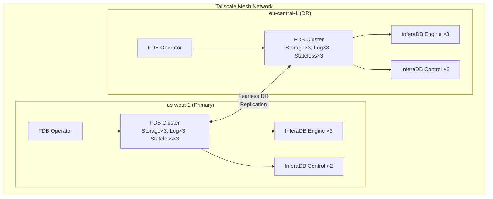
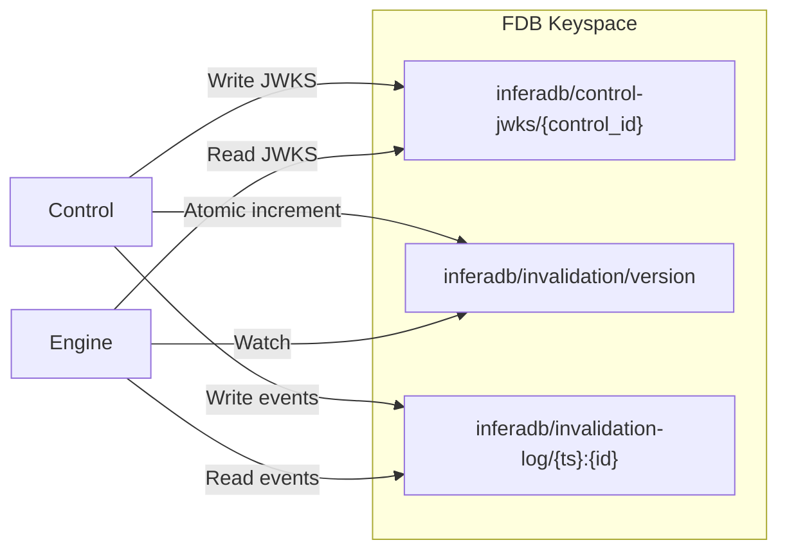
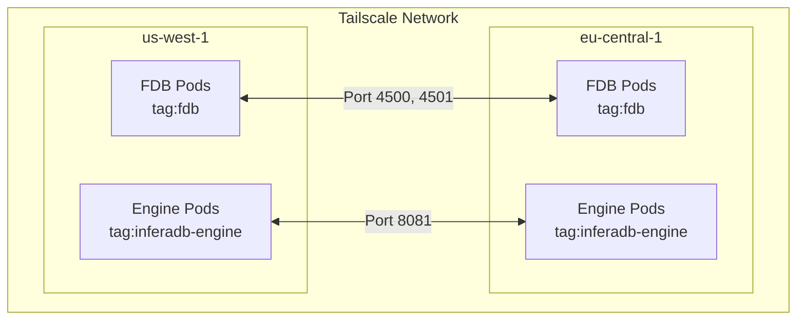
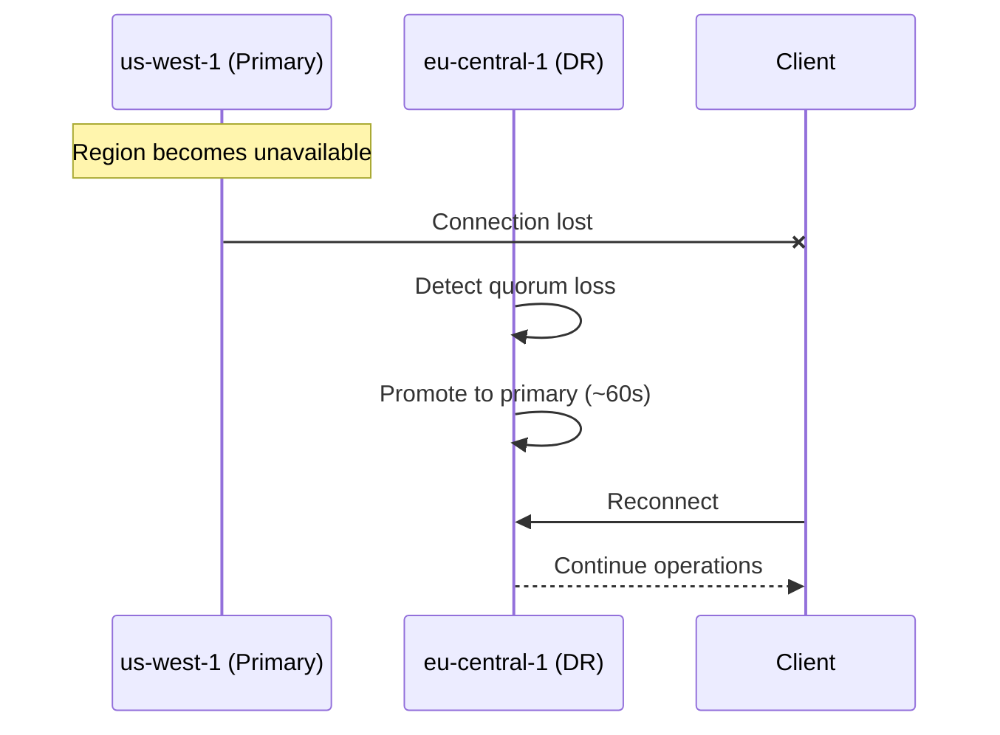
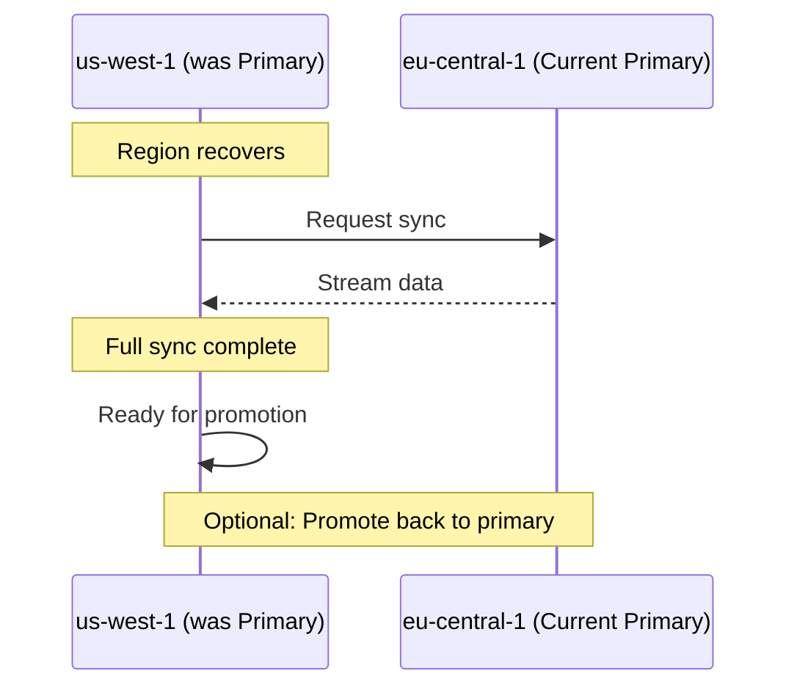

# FoundationDB Multi-Region Deployment Guide

This guide covers deploying InferaDB with FoundationDB's Fearless DR for multi-region high availability.

## Overview

InferaDB uses FoundationDB's native multi-region replication ("Fearless DR") for data synchronization across regions. This provides:

- **Sub-second failover**: Automatic promotion of DR region when primary fails
- **Strong consistency**: ACID transactions across regions
- **Low operational overhead**: Single database system to manage
- **Cross-service communication**: Control and Engine share data via FDB (JWKS, cache invalidation)

## Architecture



## FDB Shared Keyspace

Control and Engine communicate through FDB, eliminating HTTP dependencies between services:



This architecture enables:

- **JWKS Discovery**: Engine reads Control's public keys from FDB instead of HTTP
- **Cache Invalidation**: Engine watches for invalidation events via FDB watch API
- **Multi-region**: FDB Fearless DR replicates all shared data automatically

## Prerequisites

1. **Kubernetes clusters** in each target region
2. **FDB Kubernetes Operator** installed in each cluster
3. **Tailscale** for cross-region networking (or alternative VPN)
4. **Storage class** capable of provisioning persistent volumes

## Deployment Methods

### Option 1: Terraform (Recommended)

Use the provided Terraform modules for automated deployment:

```bash
cd terraform/examples/aws-multi-region
cp terraform.tfvars.example terraform.tfvars
# Edit terraform.tfvars with your configuration
terraform init
terraform apply
```

See [terraform/examples/aws-multi-region/README.md](../../terraform/examples/aws-multi-region/README.md) for details.

> **Note on Terraform Locations:**
>
> - `terraform/` (repo root) - Example configurations and reusable modules for quick-start deployments
> - `deploy/terraform/` - Production infrastructure with environment-specific configs, GitOps integration, and multi-provider support
>
> For production deployments, see [deploy/README.md](../../deploy/README.md).

### Option 2: Kubernetes Manifests

For manual deployment using kubectl:

```bash
# 1. Install FDB Operator in each cluster
helm repo add fdb https://foundationdb.github.io/fdb-kubernetes-operator/
helm install fdb-operator fdb/fdb-kubernetes-operator -n fdb-system --create-namespace

# 2. Create namespace
kubectl create namespace inferadb

# 3. Deploy Tailscale secret
kubectl create secret generic tailscale-auth \
  --from-literal=authkey=$TAILSCALE_AUTH_KEY \
  -n inferadb

# 4. Deploy FDB cluster (primary first, then secondary)
kubectl apply -f engine/k8s/fdb/fdb-cluster-primary.yaml
kubectl apply -f engine/k8s/fdb/fdb-cluster-secondary.yaml
```

## Configuration

### Redundancy Modes

| Mode               | Copies | Fault Tolerance    | Use Case                 |
| ------------------ | ------ | ------------------ | ------------------------ |
| `single`           | 1      | None               | Development only         |
| `double`           | 2      | 1 machine failure  | Production (recommended) |
| `triple`           | 3      | 2 machine failures | High security            |
| `three_datacenter` | 3      | 1 datacenter       | Multi-DC same region     |

### Multi-Region Configuration

The `regions` configuration in FDB defines the replication topology:

```yaml
databaseConfiguration:
  redundancy_mode: double
  storage_engine: ssd-2
  usable_regions: 1 # Regions that must be available for writes
  regions:
    - datacenters:
        - id: us-west-1
          priority: 1 # Lower = higher priority (primary)
        - id: us-west-1a
          priority: 1
          satellite: 0
    - datacenters:
        - id: eu-central-1
          priority: 2 # DR region
        - id: eu-central-1a
          priority: 2
          satellite: 0
```

**Key parameters:**

| Parameter        | Description                         | Recommended              |
| ---------------- | ----------------------------------- | ------------------------ |
| `usable_regions` | Regions required for writes         | 1 (for DR mode)          |
| `priority`       | Failover priority (lower = primary) | 1 for primary, 2+ for DR |
| `satellite`      | Satellite log configuration         | 0 (disabled)             |
| `storage_engine` | Storage engine type                 | ssd-2                    |

### Process Counts

Scale processes based on your workload:

| Workload | Storage | Log | Stateless | ClusterController |
| -------- | ------- | --- | --------- | ----------------- |
| Small    | 3       | 3   | 3         | 1                 |
| Medium   | 5       | 5   | 5         | 1                 |
| Large    | 9+      | 9+  | 9+        | 1                 |

**Guidelines:**

- Storage: Scale for data volume and read throughput
- Log: Scale for write throughput
- Stateless: Scale for coordinator redundancy
- ClusterController: Always 1 per cluster

## Cross-Region Networking

### Tailscale Setup



1. **Create auth key** at <https://login.tailscale.com/admin/settings/keys>
   - Make it reusable
   - Add tags: `tag:fdb`, `tag:inferadb-engine`

2. **Configure ACLs**:

   ```json
   {
     "acls": [
       {
         "action": "accept",
         "src": ["tag:fdb"],
         "dst": ["tag:fdb:4500,4501"]
       },
       {
         "action": "accept",
         "src": ["tag:inferadb-engine"],
         "dst": ["tag:fdb:4500,4501"]
       }
     ],
     "tagOwners": {
       "tag:fdb": ["autogroup:admin"],
       "tag:inferadb-engine": ["autogroup:admin"]
     }
   }
   ```

3. **Deploy sidecar** - The Tailscale sidecar is included in the FDB cluster manifests:

   ```yaml
   containers:
     - name: tailscale
       image: tailscale/tailscale:latest
       env:
         - name: TS_AUTHKEY
           valueFrom:
             secretKeyRef:
               name: tailscale-auth
               key: authkey
         - name: TS_USERSPACE
           value: "true"
   ```

### Alternative: VPC Peering

If not using Tailscale, configure VPC peering between regions:

1. Create VPC peering connection
2. Update route tables in both VPCs
3. Configure security groups to allow FDB ports (4500, 4501)

## Monitoring

### FDB CLI Commands

```bash
# Connect to FDB CLI
kubectl exec -it inferadb-fdb-storage-0 -n inferadb -c foundationdb -- fdbcli

# Common commands
status                    # Overall cluster status
status details            # Detailed information
status json               # JSON output for parsing
getrangekeys \x00 \xff 10 # Sample keys
```

### Key Metrics

| Metric                        | Description            | Alert Threshold |
| ----------------------------- | ---------------------- | --------------- |
| `fdb_database_available`      | Database availability  | == 0            |
| `fdb_replication_lag_seconds` | Replication delay      | > 5s            |
| `fdb_coordinators_connected`  | Connected coordinators | < 3             |
| `fdb_storage_used_bytes`      | Storage utilization    | > 80%           |

### Prometheus Queries

```promql
# Database availability
fdb_database_available

# Replication lag
fdb_replication_lag_seconds

# Storage utilization
fdb_storage_used_bytes / fdb_storage_total_bytes * 100
```

## Failover Procedures

### Automatic Failover



FDB Fearless DR handles most failures automatically:

1. Primary region becomes unavailable
2. Coordinators in DR region detect quorum loss
3. DR region promoted to primary (typically < 60 seconds)
4. Applications continue with minimal disruption

### Manual Failover (Testing)

```bash
# Force failover to DR region
kubectl exec -it inferadb-fdb-storage-0 -n inferadb -c foundationdb \
  --context eks-dr -- fdbcli --exec "force_recovery_with_data_loss"
```

**Warning:** `force_recovery_with_data_loss` may result in data loss if the primary has uncommitted transactions.

### Failback



After the original primary recovers:

1. It automatically re-syncs from the current primary
2. Wait for full synchronization (check `status details`)
3. Optionally promote back to primary:

   ```bash
   kubectl exec -it inferadb-fdb-storage-0 -n inferadb -c foundationdb \
     --context eks-primary -- fdbcli --exec "force_recovery_with_data_loss"
   ```

## Troubleshooting

### Cluster Not Forming

**Symptoms:** FDB pods running but cluster unavailable

**Checks:**

1. Operator logs: `kubectl logs -n fdb-system deploy/fdb-operator`
2. Coordinator connectivity: `kubectl exec -it inferadb-fdb-storage-0 -n inferadb -c foundationdb -- fdbcli --exec "coordinators"`
3. Network connectivity between pods

### Replication Not Working

**Symptoms:** High replication lag or no DR synchronization

**Checks:**

1. Tailscale connectivity: `kubectl exec -it inferadb-fdb-storage-0 -n inferadb -c tailscale -- tailscale status`
2. Multi-region config matches in both clusters
3. FDB status: `fdbcli --exec "status details"`

### High Latency

**Symptoms:** Slow authorization decisions

**Checks:**

1. Local vs. remote reads: Ensure Engine connects to local FDB
2. Network latency between regions
3. FDB storage engine (use `ssd-2` for production)

## Best Practices

1. **Use dedicated FDB nodes** with NVMe storage for best performance
2. **Monitor replication lag** and alert on > 5 seconds
3. **Test failover regularly** in staging environments
4. **Use consistent configuration** across all regions
5. **Enable TLS** for production deployments
6. **Document runbooks** for your operations team
7. **Pin FDB version** in manifests to avoid unexpected upgrades

## References

- [FoundationDB Configuration](https://apple.github.io/foundationdb/configuration.html)
- [Fearless DR Documentation](https://apple.github.io/foundationdb/configuration.html#fearless-dr)
- [FDB Kubernetes Operator](https://github.com/FoundationDB/fdb-kubernetes-operator)
- [Tailscale Kubernetes](https://tailscale.com/kb/1185/kubernetes)

## Related Tools

- **[Terraform Provider for InferaDB](../../terraform-provider-inferadb/README.md)**: Manage Control Plane resources (organizations, vaults, clients, grants) via Terraform. Use this for provisioning application-level resources after infrastructure deployment.
