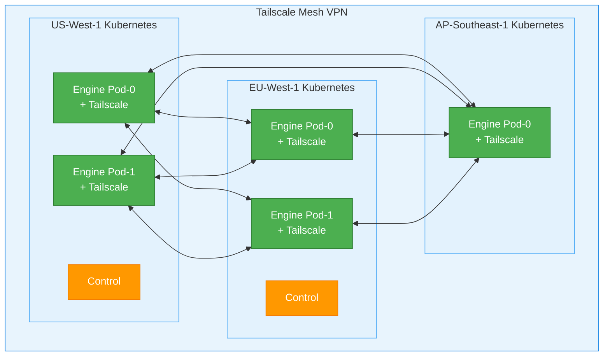

# Tailscale Multi-Region Deployment Guide

This guide explains how to deploy InferaDB across multiple regions using Tailscale mesh networking for cross-cluster service discovery.

## Table of Contents

- [Overview](#overview)
- [Prerequisites](#prerequisites)
- [Tailscale Setup](#tailscale-setup)
- [Deployment Architecture](#deployment-architecture)
- [Configuration](#configuration)
- [Deployment Steps](#deployment-steps)
- [Verification](#verification)
- [Troubleshooting](#troubleshooting)
- [Metrics](#metrics)

## Overview

Tailscale integration enables InferaDB to discover and communicate with service instances across multiple Kubernetes clusters in different regions without complex VPN setups or exposed public endpoints.

**Benefits:**

- **Zero-trust mesh networking**: Encrypted WireGuard tunnels between all nodes
- **Automatic discovery**: MagicDNS resolves service names to pod IPs across clusters
- **No firewall rules**: Tailscale handles NAT traversal automatically
- **Multi-cloud support**: Works across AWS, GCP, Azure, on-premise, etc.
- **Low latency**: Direct peer-to-peer connections when possible

## Prerequisites

1. **Tailscale Account**: Sign up at <https://tailscale.com>
2. **Multiple Kubernetes Clusters**: Running in different regions/clouds
3. **Kubernetes v1.19+**: With RBAC enabled
4. **InferaDB v0.1.0+**: With Tailscale discovery support

## Tailscale Setup

### 1. Create Tailscale Auth Keys

Generate auth keys for each cluster at <https://login.tailscale.com/admin/settings/keys>

**Recommended settings:**

- **Reusable**: Yes (for multi-pod deployments)
- **Ephemeral**: No (persist across pod restarts)
- **Tags**: Add cluster-specific tags (e.g., `tag:inferadb-us-west-1`)
- **Expiry**: 90 days (or longer for production)

**Example CLI:**

```bash
# Install Tailscale CLI
curl -fsSL https://tailscale.com/install.sh | sh

# Generate auth key
tailscale configure key create \
  --reusable \
  --tag tag:inferadb-us-west-1 \
  --expiry 90d
```

### 2. Configure MagicDNS

Enable MagicDNS in your Tailscale admin console:

1. Go to <https://login.tailscale.com/admin/dns>
2. Enable **MagicDNS**
3. (Optional) Set up custom nameservers for your clusters

### 3. Create Tailscale Networks (Optional)

For better isolation, create separate Tailscale networks (tailnets) for different environments:

- **Production**: `inferadb-prod.ts.net`
- **Staging**: `inferadb-staging.ts.net`
- **Development**: `inferadb-dev.ts.net`

## Deployment Architecture

### Multi-Region Topology



### Service Discovery Flow

1. **Local Cluster Discovery**: Kubernetes Endpoints API discovers local pods
2. **Remote Cluster Discovery**: Tailscale MagicDNS resolves service names across regions
3. **Endpoint Aggregation**: All endpoints (local + remote) aggregated for load balancing
4. **Health Checking**: Optional HTTP health checks validate endpoint availability

## Configuration

### Engine Configuration

**Helm values.yaml** (US-West-1):

```yaml
# Enable Tailscale discovery mode
discovery:
  mode: "tailscale"

  tailscale:
    enabled: true
    localCluster: "us-west-1"

    # Remote clusters to discover
    remoteClusters:
      - name: "eu-west-1"
        tailscaleDomain: "eu-west-1.ts.net"
        serviceName: "inferadb-control"
        port: 9090

      - name: "ap-southeast-1"
        tailscaleDomain: "ap-southeast-1.ts.net"
        serviceName: "inferadb-control"
        port: 9090

    # Tailscale auth key secret
    authKey:
      existingSecret: "tailscale-auth"
      key: "authkey"

    # Tailscale sidecar configuration
    image:
      repository: tailscale/tailscale
      tag: "v1.56.1"

    resources:
      requests:
        cpu: 50m
        memory: 64Mi
      limits:
        cpu: 200m
        memory: 128Mi

    # Additional Tailscale arguments
    extraArgs: "--accept-routes --advertise-routes=10.0.0.0/8"
    acceptDNS: false
```

### Control Configuration

**config.yaml** (US-West-1):

```yaml
cache_invalidation:
  discovery:
    mode:
      type: tailscale
      local_cluster: "us-west-1"
      remote_clusters:
        - name: "eu-west-1"
          tailscale_domain: "eu-west-1.ts.net"
          service_name: "inferadb-engine"
          port: 8080

        - name: "ap-southeast-1"
          tailscale_domain: "ap-southeast-1.ts.net"
          service_name: "inferadb-engine"
          port: 8080

  http_endpoints: [] # Leave empty when using discovery
  timeout_ms: 5000
  retry_attempts: 2
```

### Environment Variables

Alternatively, use environment variables:

```bash
# Engine
export INFERADB__AUTH__DISCOVERY__MODE__TYPE=tailscale
export INFERADB__AUTH__DISCOVERY__MODE__LOCAL_CLUSTER=us-west-1
export INFERADB__AUTH__DISCOVERY__MODE__REMOTE_CLUSTERS__0__NAME=eu-west-1
export INFERADB__AUTH__DISCOVERY__MODE__REMOTE_CLUSTERS__0__TAILSCALE_DOMAIN=eu-west-1.ts.net
export INFERADB__AUTH__DISCOVERY__MODE__REMOTE_CLUSTERS__0__SERVICE_NAME=inferadb-control
export INFERADB__AUTH__DISCOVERY__MODE__REMOTE_CLUSTERS__0__PORT=9090

# Control
export INFERADB_CTRL__CACHE_INVALIDATION__DISCOVERY__MODE__TYPE=tailscale
export INFERADB_CTRL__CACHE_INVALIDATION__DISCOVERY__MODE__LOCAL_CLUSTER=us-west-1
```

## Deployment Steps

### Step 1: Create Tailscale Secrets

For each cluster, create a Kubernetes secret with the Tailscale auth key:

```bash
# US-West-1
kubectl create secret generic tailscale-auth \
  --from-literal=authkey=tskey-auth-XXXXXX \
  --namespace=inferadb \
  --dry-run=client -o yaml | kubectl apply -f -

# EU-West-1
kubectl create secret generic tailscale-auth \
  --from-literal=authkey=tskey-auth-YYYYYY \
  --namespace=inferadb \
  --context=eu-west-1 \
  --dry-run=client -o yaml | kubectl apply -f -

# AP-Southeast-1
kubectl create secret generic tailscale-auth \
  --from-literal=authkey=tskey-auth-ZZZZZZ \
  --namespace=inferadb \
  --context=ap-southeast-1 \
  --dry-run=client -o yaml | kubectl apply -f -
```

### Step 2: Deploy InferaDB with Tailscale

Deploy to each cluster with cluster-specific configuration:

```bash
# US-West-1
helm install inferadb ./helm \
  --namespace inferadb \
  --create-namespace \
  --values values-us-west-1.yaml

# EU-West-1
helm install inferadb ./helm \
  --namespace inferadb \
  --create-namespace \
  --values values-eu-west-1.yaml \
  --kube-context=eu-west-1

# AP-Southeast-1
helm install inferadb ./helm \
  --namespace inferadb \
  --create-namespace \
  --values values-ap-southeast-1.yaml \
  --kube-context=ap-southeast-1
```

### Step 3: Verify Tailscale Connectivity

Check that pods have joined the Tailscale network:

```bash
# Check Tailscale status in a pod
kubectl exec -it inferadb-engine-0 -c tailscale \
  --namespace=inferadb \
  -- tailscale status

# Expected output:
# 100.64.0.1   inferadb-engine-0  -
# 100.64.0.2   inferadb-engine-1  -
# 100.64.1.1   inferadb-engine-0  eu-west-1
# 100.64.1.2   inferadb-engine-1  eu-west-1
```

## Verification

### Test Cross-Cluster Discovery

```bash
# Check discovered endpoints from US-West-1
kubectl logs -f inferadb-engine-0 -c inferadb-engine \
  --namespace=inferadb \
  | grep "Discovered Tailscale endpoints"

# Expected output:
# INFO Discovered Tailscale endpoints across clusters
#   cluster=eu-west-1 endpoint_count=2
#   cluster=ap-southeast-1 endpoint_count=2
```

### Test MagicDNS Resolution

```bash
# Resolve a service name via Tailscale MagicDNS
kubectl exec -it inferadb-engine-0 -c tailscale \
  --namespace=inferadb \
  -- nslookup inferadb-control.eu-west-1.ts.net

# Expected output:
# Name: inferadb-control.eu-west-1.ts.net
# Address: 100.64.1.1
# Address: 100.64.1.2
```

### Test Cross-Cluster Cache Invalidation

Create a vault in US-West-1 and verify cache invalidation reaches EU-West-1:

```bash
# Create vault (triggers cache invalidation webhook)
curl -X POST http://control-us-west-1/v1/vaults \
  -H "Authorization: Bearer $TOKEN" \
  -d '{"name": "test-vault"}'

# Check logs in EU-West-1 engine
kubectl logs -f inferadb-engine-0 \
  --namespace=inferadb \
  --context=eu-west-1 \
  | grep "vault invalidation"

# Expected output:
# INFO Vault cache invalidation received vault_id=12345
```

## Troubleshooting

### DNS Resolution Failures

**Symptom**: `Failed to resolve Tailscale hostname`

**Solution**:

1. Check Tailscale is running:

   ```bash
   kubectl exec -it inferadb-engine-0 -c tailscale -- tailscale status
   ```

2. Verify MagicDNS is enabled in Tailscale admin console

3. Check DNS configuration:

   ```bash
   kubectl exec -it inferadb-engine-0 -c tailscale -- cat /etc/resolv.conf
   ```

### No Endpoints Discovered

**Symptom**: `No Tailscale endpoints discovered across any cluster`

**Solution**:

1. Verify remote cluster pods are running and joined Tailscale network

2. Check service names match configuration:

   ```bash
   kubectl get services --all-namespaces
   ```

3. Test manual DNS lookup:

   ```bash
   kubectl exec -it inferadb-engine-0 -c tailscale \
     -- nslookup inferadb-engine.eu-west-1.ts.net
   ```

### Tailscale Sidecar Not Starting

**Symptom**: Tailscale container in CrashLoopBackOff

**Solution**:

1. Check auth key is valid:

   ```bash
   kubectl get secret tailscale-auth -o yaml
   ```

2. Check container logs:

   ```bash
   kubectl logs inferadb-engine-0 -c tailscale
   ```

3. Verify security context allows NET_ADMIN capability:

   ```bash
   kubectl get pod inferadb-engine-0 -o yaml | grep -A5 securityContext
   ```

### High Latency Between Regions

**Symptom**: Slow cross-region requests

**Solution**:

1. Check Tailscale route preference:

   ```bash
   kubectl exec -it inferadb-engine-0 -c tailscale \
     -- tailscale status --json | jq '.Peer[] | {Name, CurAddr, Relay}'
   ```

2. Enable DERP relay fallback if direct connection fails

3. Consider using read replicas or regional routing for read-heavy workloads

## Metrics

Monitor Tailscale discovery with Prometheus metrics:

### Key Metrics

- `inferadb_tailscale_dns_resolutions_total` - DNS resolution attempts by hostname and result
- `inferadb_tailscale_discovered_endpoints` - Number of endpoints per cluster
- `inferadb_tailscale_cluster_discovery_failures_total` - Failed discovery attempts by cluster
- `inferadb_tailscale_clusters_total` - Total configured clusters

### Example Prometheus Queries

```promql
# DNS resolution success rate
sum(rate(inferadb_tailscale_dns_resolutions_total{result="success"}[5m]))
/
sum(rate(inferadb_tailscale_dns_resolutions_total[5m]))

# Endpoints per cluster
inferadb_tailscale_discovered_endpoints

# Cluster discovery failure rate
rate(inferadb_tailscale_cluster_discovery_failures_total[5m])
```

### Grafana Dashboard

Import the Tailscale discovery dashboard template from `/docs/observability/grafana-tailscale-discovery.json`

## Best Practices

1. **Use Separate Auth Keys Per Cluster**: Easier to rotate and revoke

2. **Tag Resources**: Add Tailscale tags for access control and organization

3. **Monitor DNS Resolution**: Alert on high failure rates

4. **Test Failover**: Regularly test cross-region failover scenarios

5. **Cache TTL**: Tune discovery cache TTL based on your change frequency (default: 300s)

6. **Resource Limits**: Tailscale sidecar needs minimal resources (50m CPU, 64Mi RAM)

7. **Security**: Use Tailscale ACLs to restrict which pods can communicate

8. **Network Policies**: Combine with Kubernetes NetworkPolicies for defense-in-depth

## Security Considerations

- **Encryption**: All traffic encrypted with WireGuard (industry-standard)
- **Authentication**: Auth keys should be rotated regularly (90-day expiry recommended)
- **ACLs**: Use Tailscale ACLs to enforce least-privilege access
- **Audit Logs**: Enable Tailscale audit logging for compliance
- **Secret Management**: Use External Secrets Operator or Sealed Secrets for auth keys

## Next Steps

- [FoundationDB Multi-Region Setup](./foundationdb-multi-region.md)
- [Disaster Recovery Guide](./disaster-recovery.md)
- [Performance Tuning](./performance-tuning.md)
