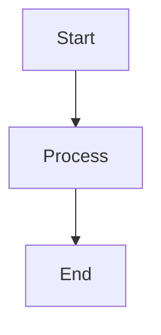

# Documentation Style Guide

**Author(s):** InferaDB Team
**Status:** Active
**Created:** 2025-12-03
**Updated:** 2025-12-03

---

## Overview

This guide establishes consistent conventions for all InferaDB documentation across `docs/`, `server/docs/`, and `management/docs/`.

## File Naming

### Convention

Use **kebab-case** for all documentation files:

```
getting-started.md
audit-logs.md
local-k8s-testing.md
```

### Exceptions

Product names and proper nouns retain their original casing:

```
OpenFGA.md
SpiceDB.md
InferaDB.md
```

### Rationale

- Kebab-case is URL-friendly and consistent across platforms
- Avoids case-sensitivity issues on different file systems
- Improves readability in file listings

## Headers

### Format

Use **plain text Title Case** for all headers:

```markdown
## Getting Started

## Technical Specification

## Security Considerations
```

### Avoid

Do not use bold formatting or numbering in headers:

```markdown
## **1. Getting Started** # Incorrect

## **Technical Specification** # Incorrect

## 2. Security # Incorrect
```

### Rationale

- Markdown heading syntax already provides visual hierarchy
- Numbering creates maintenance burden when sections are reordered
- Bold in headers is redundant and clutters table of contents

## Document Structure

### Required Sections

All RFCs and design documents should include:

1. **Summary** - Brief overview of the proposal
2. **Motivation** - Problem being solved
3. **Design Overview** - High-level approach
4. **Technical Specification** - Detailed implementation

See [rfc-template.md](rfc-template.md) for the complete template.

### Optional Sections

Include as relevant:

- Alternatives Considered
- Drawbacks
- Security and Privacy Considerations
- Rollout and Adoption Plan
- References

## Cross-References

### Internal Links

Use relative paths for links within the same repository:

```markdown
See [Getting Started](getting-started.md)
See [Authentication](../authentication.md)
```

### External Links

Use full URLs for external resources:

```markdown
[OpenFGA Documentation](https://openfga.dev/docs)
```

## Code Blocks

### Language Tags

Always specify the language for syntax highlighting:

````markdown
```rust
fn main() {
    println!("Hello, InferaDB!");
}
```
````

### Common Languages

| Tag        | Usage                        |
| ---------- | ---------------------------- |
| `rust`     | Rust code                    |
| `praxis`   | Infera Policy Language (IPL) |
| `bash`     | Shell commands               |
| `json`     | JSON data                    |
| `yaml`     | YAML configuration           |
| `markdown` | Markdown examples            |
| `mermaid`  | Diagrams and flowcharts      |

## Diagrams

### Prefer Mermaid

Use **Mermaid diagrams** instead of ASCII art for architecture diagrams, flowcharts, sequence diagrams, and entity relationships:

````markdown

````

### Avoid ASCII Art

Do not use plaintext ASCII diagrams with box-drawing characters:

````markdown
```plaintext
┌─────────┐
│  Start  │
└────┬────┘
     │
     ▼
┌─────────┐
│ Process │
└─────────┘
```
````

### Why Mermaid

- Mermaid renders consistently across platforms and devices
- Easier to maintain and modify
- Supports interactivity (zoom, pan) in compatible viewers
- Better accessibility for screen readers
- Automatic layout prevents manual alignment issues

### Mermaid Diagram Types

| Type              | Use Case                              |
| ----------------- | ------------------------------------- |
| `flowchart`       | Process flows, decision trees         |
| `graph`           | Architecture, component relationships |
| `sequenceDiagram` | API flows, request/response           |
| `erDiagram`       | Data models, entity relationships     |
| `classDiagram`    | Object hierarchies                    |

### When to Use Plaintext

Use plaintext for directory trees and simple file listings:

```
docs/
├── templates/
│   └── style-guide.md
└── whitepapers/
    └── InferaDB.md
```

## Tables

### Format

Use consistent column alignment:

```markdown
| Column A | Column B | Column C |
| -------- | -------- | -------- |
| Value 1  | Value 2  | Value 3  |
```

### Guidelines

- Left-align text columns
- Right-align numeric columns when appropriate
- Keep column widths consistent within a table

## Examples

### Good Header Structure

```markdown
# Document Title

## Overview

Brief introduction to the topic.

## Getting Started

### Prerequisites

List of requirements.

### Installation

Step-by-step guide.

## Configuration

### Basic Setup

Minimal configuration.

### Advanced Options

Additional settings.
```

### Good File Organization

```
docs/
├── deployment/
│   ├── local-k8s-testing.md
│   ├── service-discovery.md
│   └── tailscale-multi-region.md
├── templates/
│   ├── rfc-template.md
│   └── style-guide.md
└── whitepapers/
    └── InferaDB.md
```
