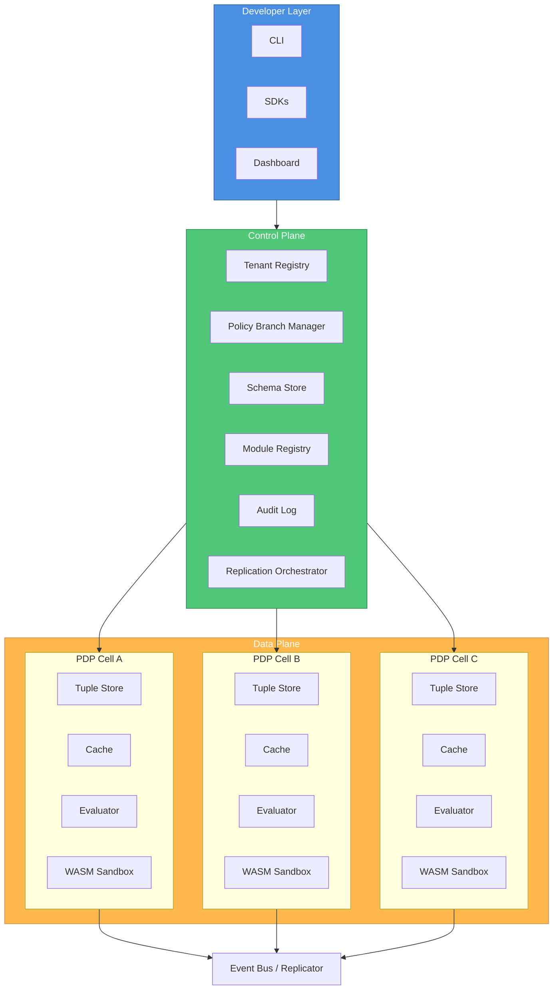

# InferaDB

**The Inference Database for Fine-Grained Authorization**

Modern applications demand fine-grained, contextual authorization systems capable of enforcing access control across distributed, multi-tenant, and multi-region environments. Traditional role-based (RBAC) and attribute-based (ABAC) systems fail to scale with the complexity of today’s ecosystems, where relationships, hierarchies, and dynamic policies define access semantics.

**InferaDB** is an inference-driven authorization database that unifies relationship-based access control (ReBAC), logical policy reasoning, and standardized interoperability through the **AuthZEN** specification. It draws inspiration from **Google Zanzibar** [1], incorporates the execution and co-location principles of **SpacetimeDB** [2], and introduces a modular, reasoning-first approach to access control through deterministic policy inference and sandboxed logic execution.

Built entirely in **Rust** for low-latency and strong consistency, with a **TypeScript** dashboard for developer accessibility, InferaDB delivers authorization that is **explainable, auditable, and composable** — by design.

## Executive Summary

InferaDB addresses three critical challenges in modern authorization:

| Challenge                      | Solution                                                                                                                                                                                                                                             |
| ------------------------------ | ---------------------------------------------------------------------------------------------------------------------------------------------------------------------------------------------------------------------------------------------------- |
| **Complexity at Scale**        | Traditional RBAC/ABAC systems fragment under distributed, multi-tenant architectures. InferaDB models authorization as a graph of relationships with logical inference, enabling natural expression of hierarchies, groups, and derived permissions. |
| **Compliance by Design**       | Every authorization decision is revision-tracked, cryptographically signed, and replayable. Audit logs are append-only and hash-chained, enabling SOC 2, HIPAA, and GDPR compliance requirements by default.                                         |
| **Extensibility Without Risk** | Domain-specific logic (IP ranges, subscription tiers, workflow states) runs in sandboxed WASM modules—enabling custom rules without compromising determinism, security, or auditability.                                                             |

**Key Differentiators:**

- **AuthZEN-native:** First-class support for the OpenID Foundation's authorization API specification, enabling vendor-neutral interoperability.
- **Sub-10ms latency:** Co-located computation with data in isolated PDP cells achieves consistently low latency under multi-tenant workloads.
- **Policy-as-code:** The Infera Policy Language (IPL) enables version-controlled, testable, and reviewable authorization logic.

## Motivation

Authorization is one of the most critical yet under-engineered components of modern distributed systems. Developers often hardcode access rules, deploy unverified policy code, or rely on brittle role-based systems that collapse under the complexity of real-world resource graphs.
Common challenges include:

- Inconsistent authorization logic across services.
- Poor visibility and auditability of decisions.
- Scaling decision latency under high RPS workloads.
- Difficulty modeling relationships between entities and actions.
- Lack of standardization for interoperability and policy exchange.

**InferaDB** addresses these challenges by modeling authorization as a graph of relationships and logical inferences, not just static roles or attributes.

## Design Philosophy

The design of InferaDB is guided by five core principles:

| Principle                        | Description                                                                                                                                                     |
| -------------------------------- | --------------------------------------------------------------------------------------------------------------------------------------------------------------- |
| **Inference as a Primitive**     | Authorization is derived from reasoning, not static checks. Each decision represents a provable inference derived from relationships, policies, and conditions. |
| **Consistency Above All**        | Strongly consistent reads and writes ensure deterministic outcomes under high concurrency.                                                                      |
| **Composable Policy Logic**      | Policies are declarative, modular, and composable. Developers can extend logic safely through sandboxed WASM modules.                                           |
| **Developer-Centric Experience** | Authorization should be understandable, testable, and observable. Tooling matters as much as throughput.                                                        |
| **Transparent Trust**            | Every decision is auditable, signed, and replayable. Determinism is verifiable through revision tokens and tamper-evident logs.                                 |

## System Overview

InferaDB consists of two core planes:

- **Control Plane:** Manages tenants, schemas, policies, and replication topology.
- **Data Plane:** Executes authorization checks in isolated, per-tenant **PDP (Policy Decision Point)** cells that co-locate computation with data.

This architecture ensures predictable performance, fault isolation, and causal consistency across globally distributed deployments.

## Architecture

### High-Level Architecture



Each **PDP cell** operates autonomously with local data and computation, reducing cross-region latency while preserving strong consistency through causally ordered replication.

## Infera Policy Language (IPL)

The **Infera Policy Language** (IPL) provides a declarative syntax for modeling entities, relationships, and permissions. It’s inspired by OpenFGA’s schema language but extended with conditions, contextual attributes, and logic composition.

### Example Schema

```praxis
entity document {
  relation viewer: user | group#member
  relation editor: user
  relation owner: user
  attribute is_public: bool

  permission view = viewer or editor or (is_public == true)
  permission edit = editor or owner
}
```

### Computed Conditions

```praxis
context time_now: datetime

permission view = viewer or (is_public == true and time_now < resource.expiry)
```

### Goals

- **Deterministic:** Same data and inputs → same result.
- **Composable:** Policies can reference other permissions or modules.
- **Validatable:** Pre-deployment linting and static analysis ensure safety.

## WASM Policy Modules

While declarative policies cover most authorization logic, real-world access control often depends on **contextual or domain-specific logic** — such as IP ranges, subscription tiers, workflow states, or compliance rules.

InferaDB supports **WASM Policy Modules**: sandboxed, tenant-scoped logic extensions that execute in-process within each PDP cell. Each module is:

- **Portable and deterministic:** Compiled to WebAssembly from Rust, TypeScript, or any WASM-compatible language.
- **Signed and versioned:** Immutable once published, with cryptographic signatures for auditability.
- **Resource-constrained:** CPU and memory limits enforced by the runtime sandbox.
- **Invoked from IPL:** Policies call modules via the `module` namespace.

### Example: Contextual Access Control

An enterprise document platform might allow viewing based on relationships, but require additional checks for confidential documents accessed from external networks:

```praxis
entity document {
  relation viewer: user | group#member
  attribute classification: string

  permission view = viewer or module.check_network_access(context, resource)
}
```

The `check_network_access` module (written in Rust or TypeScript) can inspect the request context, verify IP ranges, check compliance flags, and return a boolean—all within a deterministic, auditable sandbox.

### Security Model

| Property         | Guarantee                                                            |
| ---------------- | -------------------------------------------------------------------- |
| **Isolation**    | No I/O, network, or filesystem access from WASM modules.             |
| **Determinism**  | Static analysis rejects modules with non-deterministic imports.      |
| **Auditability** | Every invocation is logged with module version, inputs, and outputs. |
| **Versioning**   | Policies reference explicit module versions—no implicit upgrades.    |

WASM modules transform InferaDB from a relationship graph into a **programmable reasoning system**, enabling domain-specific logic while maintaining strong consistency and security guarantees.

## Consistency Model

Authorization systems face a fundamental tension: **strong consistency** ensures correct access decisions, but **global coordination** introduces latency. InferaDB resolves this through a carefully designed consistency model that prioritizes correctness while enabling low-latency reads.

### The New Enemy Problem

Consider a scenario where Alice removes Bob's access to a document at 10:00:00. If Bob's read request at 10:00:01 reaches a replica that hasn't yet received the revocation, Bob incorrectly gains access. This is the **"new enemy problem"** described in the Zanzibar paper—and it's why eventual consistency is unacceptable for authorization.

### Revision Tokens

Every authorization decision references a **revision token**: a monotonically increasing identifier representing a consistent snapshot of the relationship graph.

Clients can:

- **Request at-least revision:** "Check access using data at least as fresh as revision `R`."
- **Receive revision in response:** "This decision was made at revision `R`."
- **Pass revision between services:** Ensures causal consistency across distributed calls.

This design enables **read-your-writes consistency** without global coordination on every request.

### Consistency Guarantees

| Operation        | Guarantee                              | Trade-off                                          |
| ---------------- | -------------------------------------- | -------------------------------------------------- |
| **Writes**       | Linearizable within region             | Single-writer-per-key prevents conflicts           |
| **Reads**        | Snapshot isolation via revision tokens | Slight staleness acceptable with token propagation |
| **Cross-region** | Causal ordering via event streams      | Bounded replication lag (typically <100ms)         |

### Why This Matters

- **Compliance:** Auditors can replay any historical decision by specifying its revision token.
- **Debugging:** "Why did this access succeed at 10:00:00?" becomes answerable.
- **Correctness:** No false positives from stale data when revision tokens are propagated correctly.

## Scalability and Performance

InferaDB achieves high throughput and low latency through architectural decisions that co-locate computation with data and minimize cross-region coordination.

### Performance Characteristics

| Metric             | Target                | Achieved Through                                  |
| ------------------ | --------------------- | ------------------------------------------------- |
| **Median latency** | <10ms                 | Co-located PDP cells with local tuple storage     |
| **P99 latency**    | <50ms                 | Multi-tier caching, connection pooling            |
| **Throughput**     | Horizontally scalable | Sharding by tenant/namespace, stateless API layer |

### Architecture for Scale

**Co-located Computation:** Each PDP cell maintains its own tuple store replica, eliminating network round-trips for authorization checks. The evaluator, cache, and WASM sandbox run in the same process.

**Sharding Strategy:** Tenants are assigned to PDP cells based on consistent hashing. Large tenants can be further sharded by namespace or resource type.

**Caching Hierarchy:**

1. **L1 (in-process):** Hot tuples and policy definitions cached per-cell.
2. **L2 (distributed):** Cross-cell cache for frequently accessed data.
3. **L3 (storage):** FoundationDB provides durable, strongly consistent storage.

### Scaling Mechanisms

- **Horizontal PDP scaling:** Add cells as load increases; service discovery routes requests automatically.
- **Batch ingestion:** Bulk tuple operations for initial data loads and migrations.
- **Streaming updates:** Real-time tuple changes propagate via event streams.
- **Read replicas:** Deploy read-only cells closer to users for latency-sensitive workloads.

## Security Model

InferaDB is designed with a **zero-trust architecture** where every component assumes compromise of adjacent systems. Security is not an add-on—it's foundational to the design.

### Threat Model

| Threat                       | Mitigation                                                            |
| ---------------------------- | --------------------------------------------------------------------- |
| **Unauthorized data access** | Per-tenant encryption keys; namespace isolation at storage layer      |
| **Policy tampering**         | Cryptographic signatures on all policy and schema changes             |
| **Malicious WASM modules**   | Static analysis rejects non-deterministic imports; runtime sandboxing |
| **Audit log manipulation**   | Append-only, hash-chained logs; external attestation support          |
| **Network interception**     | End-to-end mTLS between all components                                |
| **Privilege escalation**     | Least-privilege service accounts; tenant-scoped API tokens            |

### Defense in Depth

**Tenant Isolation:** Each tenant operates in a logically isolated namespace. PDP cells enforce strict boundaries—a bug or misconfiguration in one tenant's policy cannot affect another.

**Immutable Audit Trail:** Every authorization decision is logged with:

- Request parameters (subject, resource, action, context)
- Decision result and explanation path
- Policy version and revision token
- Timestamp and cryptographic signature

Logs are append-only and hash-chained, enabling tamper detection. Organizations can export logs to external SIEM systems for compliance.

### Compliance Mapping

| Framework   | Relevant Controls                                                          |
| ----------- | -------------------------------------------------------------------------- |
| **SOC 2**   | CC6.1 (logical access), CC7.2 (system monitoring)                          |
| **HIPAA**   | Access controls (§164.312(a)), Audit controls (§164.312(b))                |
| **GDPR**    | Article 25 (data protection by design), Article 30 (records of processing) |
| **PCI DSS** | Requirement 7 (restrict access), Requirement 10 (track access)             |

### Supply Chain Security

- **Signed releases:** All InferaDB binaries are signed and verifiable.
- **SBOM:** Software Bill of Materials published for each release.
- **Dependency scanning:** Automated vulnerability detection in CI/CD.

## Developer Experience

### CLI

`inferadb` — a unified command-line tool for:

- Initializing projects and schemas.
- Branching and merging policies.
- Uploading modules.
- Simulating authorization checks.

Example:

```bash
inferadb policy branch feature/new-rule
inferadb simulate --resource document:1 --subject user:evan
inferadb merge feature/new-rule
```

### SDKs

The official **Rust SDK** provides idiomatic bindings for:

- Tuple operations.
- Policy checks.
- Audit log queries.
- AuthZEN-compatible decision requests.

### Dashboard

The **Infera Dashboard** allows developers to visualize schemas, simulate access paths, and analyze decision traces in real time.

## Implementation Overview

| Component                  | Language          | Description                                            |
| -------------------------- | ----------------- | ------------------------------------------------------ |
| **Engine**                 | Rust              | Core inference and policy evaluation engine.           |
| **Control**                | Rust              | Tenant management, policy registry, audit log API.     |
| **Dashboard**              | TypeScript        | Web interface for visualization and simulation.        |
| **WASM Modules**           | Rust / TypeScript | Sandbox-executed custom policy logic.                  |
| **Meta-Repo (`inferadb`)** | N/A               | Orchestration and containerization of the full system. |

## Deployment and Infrastructure

### Local Development

- **Docker Compose** or **Tilt** for rapid iteration.
- Local FoundationDB for tuple storage.
- Hot reload of dashboard and control containers.

### Production

- **Kubernetes (Helm)** for orchestrating multi-tenant clusters.
- **Terraform** for provisioning infrastructure.
- **GitHub Actions** for CI/CD pipelines.

### Repository Structure

```
inferadb/
├── engine/      # Rust authorization engine
├── control/     # Rust control API
├── dashboard/   # Dashboard
├── docker/      # Compose files
├── k8s/         # Kubernetes manifests
├── infra/       # Terraform, Helm, Tilt
└── config/      # Shared configuration
```

## Comparison with Alternatives

The authorization landscape includes several mature solutions. InferaDB differentiates through its combination of inference-based reasoning, standards compliance, and extensibility.

| Capability          | InferaDB                 | SpiceDB                          | OpenFGA           | Oso                  | Cerbos          |
| ------------------- | ------------------------ | -------------------------------- | ----------------- | -------------------- | --------------- |
| **Model**           | ReBAC + ABAC + Inference | ReBAC (Zanzibar)                 | ReBAC (Zanzibar)  | Polar (logic)        | YAML policies   |
| **AuthZEN Support** | Native                   | Via adapter                      | Via adapter       | No                   | No              |
| **Custom Logic**    | WASM modules             | Limited                          | Limited           | Polar rules          | CEL expressions |
| **Consistency**     | Revision tokens          | ZedTokens                        | Tuples versioning | Application-level    | Stateless       |
| **Storage**         | FoundationDB             | CockroachDB, Spanner, PostgreSQL | PostgreSQL, MySQL | In-memory / External | Stateless       |
| **Multi-tenancy**   | Native isolation         | Schema-based                     | Store-based       | Application-level    | Policy bundles  |

### When to Choose InferaDB

- **AuthZEN interoperability** is required for vendor-neutral integration.
- **Complex domain logic** (compliance rules, contextual checks) needs safe extensibility via WASM.
- **Auditability and compliance** are primary concerns (SOC 2, HIPAA, GDPR).
- **Inference-based reasoning** better fits your authorization model than pure graph traversal.

### When Alternatives May Fit Better

- **SpiceDB/OpenFGA:** Mature ecosystems with extensive documentation and community; good for pure ReBAC use cases.
- **Oso:** Embedded authorization for monolithic applications; expressive Polar language.
- **Cerbos:** Stateless, sidecar-friendly deployment; simple YAML-based policies.

## Conclusion

InferaDB represents a next-generation approach to authorization — where policies are logic, decisions are proofs, and relationships form the foundation of access reasoning.
By combining the consistency of Zanzibar, the interoperability of AuthZEN, and the composability of WASM-based modules, InferaDB establishes a new standard for trust, transparency, and developer experience in distributed access control.

> **Authorize by Reason, at Scale.**

## References

1. Pang, R. et al. "Zanzibar: Google's Consistent, Global Authorization System." _USENIX ATC 2019._ [https://research.google/pubs/zanzibar-googles-consistent-global-authorization-system/](https://research.google/pubs/zanzibar-googles-consistent-global-authorization-system/)
2. SpacetimeDB. "A Database with Co-located Compute." [https://spacetimedb.com](https://spacetimedb.com)
3. OpenID Foundation. "AuthZEN Authorization API Specification v1.0." [https://openid.net/specs/authorization-api-1_0.html](https://openid.net/specs/authorization-api-1_0.html)
4. AuthZed. "SpiceDB: Open-Source Zanzibar Implementation." [https://authzed.com/spicedb](https://authzed.com/spicedb)
5. OpenFGA. "Fine-Grained Authorization." [https://openfga.dev](https://openfga.dev)
6. Oso. "Authorization as a Service." [https://www.osohq.com](https://www.osohq.com)

## Glossary

| Term               | Definition                                                                                                                           |
| ------------------ | ------------------------------------------------------------------------------------------------------------------------------------ |
| **ABAC**           | Attribute-Based Access Control. Authorization based on attributes of subjects, resources, and environment.                           |
| **AuthZEN**        | OpenID Foundation specification for a standardized authorization API, enabling vendor-neutral interoperability.                      |
| **Control Plane**  | The management layer of InferaDB that handles tenants, schemas, policies, and replication topology.                                  |
| **Data Plane**     | The execution layer where authorization checks are performed in isolated PDP cells.                                                  |
| **IPL**            | Infera Policy Language. InferaDB's declarative language for defining entities, relationships, and permissions.                       |
| **PDP**            | Policy Decision Point. An isolated compute unit that evaluates authorization requests against policies and data.                     |
| **RBAC**           | Role-Based Access Control. Authorization based on roles assigned to subjects.                                                        |
| **ReBAC**          | Relationship-Based Access Control. Authorization derived from relationships between entities (e.g., "user is member of group").      |
| **Revision Token** | A monotonically increasing identifier representing a consistent snapshot of the relationship graph.                                  |
| **Tuple**          | A relationship record in the form `(subject, relation, resource)`, e.g., `(user:alice, viewer, document:123)`.                       |
| **WASM**           | WebAssembly. A portable binary format used for sandboxed execution of custom policy modules.                                         |
| **Zanzibar**       | Google's global authorization system, described in the 2019 USENIX ATC paper. InferaDB draws inspiration from its consistency model. |
