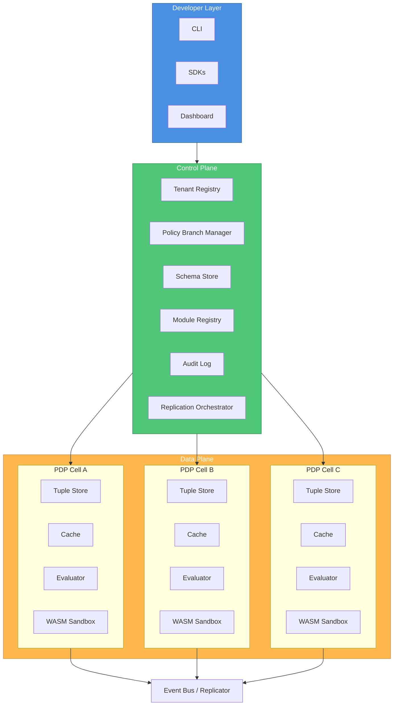

# InferaDB

**The Inference Database for Fine-Grained Authorization**

Modern applications demand fine-grained, contextual authorization systems capable of enforcing access control across distributed, multi-tenant, and multi-region environments. Traditional role-based (RBAC) and attribute-based (ABAC) systems fail to scale with the complexity of today’s ecosystems, where relationships, hierarchies, and dynamic policies define access semantics.

**InferaDB** is an inference-driven authorization database that unifies relationship-based access control (ReBAC), logical policy reasoning, and standardized interoperability through the **AuthZEN** specification. It draws inspiration from **Google Zanzibar** [1], incorporates the execution and co-location principles of **SpacetimeDB** [2], and introduces a modular, reasoning-first approach to access control through deterministic policy inference and sandboxed logic execution.

Built in **Rust** for low-latency and strong consistency, and orchestrated in **TypeScript** for developer accessibility, InferaDB delivers authorization that is **explainable, auditable, and composable** — by design.

## Motivation

Authorization is one of the most critical yet under-engineered components of modern distributed systems. Developers often hardcode access rules, deploy unverified policy code, or rely on brittle role-based systems that collapse under the complexity of real-world resource graphs.
Common challenges include:

- Inconsistent authorization logic across services.
- Poor visibility and auditability of decisions.
- Scaling decision latency under high RPS workloads.
- Difficulty modeling relationships between entities and actions.
- Lack of standardization for interoperability and policy exchange.

**InferaDB** addresses these challenges by modeling authorization as a graph of relationships and logical inferences, not just static roles or attributes.

## Design Philosophy

The design of InferaDB is guided by five core principles:

| Principle                        | Description                                                                                                                                                     |
| -------------------------------- | --------------------------------------------------------------------------------------------------------------------------------------------------------------- |
| **Inference as a Primitive**     | Authorization is derived from reasoning, not static checks. Each decision represents a provable inference derived from relationships, policies, and conditions. |
| **Consistency Above All**        | Strongly consistent reads and writes ensure deterministic outcomes under high concurrency.                                                                      |
| **Composable Policy Logic**      | Policies are declarative, modular, and composable. Developers can extend logic safely through sandboxed WASM modules.                                           |
| **Developer-Centric Experience** | Authorization should be understandable, testable, and observable. Tooling matters as much as throughput.                                                        |
| **Transparent Trust**            | Every decision is auditable, signed, and replayable. Determinism is verifiable through revision tokens and tamper-evident logs.                                 |

## System Overview

InferaDB consists of two core planes:

- **Control Plane:** Manages tenants, schemas, policies, and replication topology.
- **Data Plane:** Executes authorization checks in isolated, per-tenant **PDP (Policy Decision Point)** cells that co-locate computation with data.

This architecture ensures predictable performance, fault isolation, and causal consistency across globally distributed deployments.

## Architecture

### High-Level Architecture



Each **PDP cell** operates autonomously with local data and computation, reducing cross-region latency while preserving strong consistency through causally ordered replication.

## Infera Policy Language (IPL)

The **Infera Policy Language** (IPL) provides a declarative syntax for modeling entities, relationships, and permissions. It’s inspired by OpenFGA’s schema language but extended with conditions, contextual attributes, and logic composition.

### Example Schema

```praxis
entity document {
  relation viewer: user | group#member
  relation editor: user
  relation owner: user
  attribute is_public: bool

  permission view = viewer or editor or (is_public == true)
  permission edit = editor or owner
}
```

### Computed Conditions

```praxis
context time_now: datetime

permission view = viewer or (is_public == true and time_now < resource.expiry)
```

### Goals

- **Deterministic:** Same data and inputs → same result.
- **Composable:** Policies can reference other permissions or modules.
- **Validatable:** Pre-deployment linting and static analysis ensure safety.

## WASM Policy Modules

### Overview

While declarative policies (defined in the Infera Policy Language) cover most authorization logic, real-world access control often depends on **contextual or domain-specific logic** — such as time of day, subscription tiers, workflow states, or third-party compliance rules.

To support these dynamic conditions without sacrificing safety or consistency, InferaDB introduces **WASM Policy Modules**: lightweight, sandboxed, tenant-scoped logic extensions that execute **in-process** within each **Policy Decision Point (PDP)** cell.

Each module is:

- Compiled to **WebAssembly (WASM)** for portability and determinism.
- **Signed and versioned** per tenant to ensure immutability and auditability.
- Executed under strict CPU and memory constraints (e.g., 5ms and 32MB).
- Invoked by IPL (Infera Policy Language) permissions through the `module` namespace.

### Real-World Example

Consider a platform like **“AtlasDocs”**, an enterprise SaaS for secure document collaboration.

Access rules must adapt based on:

- **User role** within an organization (e.g., _editor_, _viewer_, _admin_).
- **Document classification level** (_confidential_, _internal_, _public_).
- **Contextual factors**, such as whether the user is accessing from a corporate network, and whether the document is currently under legal hold.

Declarative rules can model static relationships like `editor` or `viewer`, but the contextual checks — such as verifying IP range or legal hold state — are better handled by a WASM module.

### Declarative Policy

```praxis
entity document {
  relation viewer: user | group#member
  relation editor: user | group#member
  relation owner: user

  attribute classification: string
  attribute legal_hold: bool

  permission view =
      viewer
      or editor
      or (module.check_context(context, resource, subject) == true)

  permission edit =
      editor
      and module.can_edit(context, resource, subject)
}
```

The policy defines `view` and `edit` permissions that defer advanced context checks to the module.

### WASM Module Implementation

Developers can write modules in **Rust** or **TypeScript** and compile to WASM.
Below is an example implemented in **Rust**, leveraging the safety guarantees of the language while remaining fully deterministic.

```rust
// src/lib.rs

use infera_sdk::{Context, Resource, Subject};

/// Checks if a user can view a document based on contextual attributes.
/// - Only allow access if the user is within a trusted IP range or the document
///   is not marked confidential.
/// - Deny access entirely if the document is under legal hold.
#[no_mangle]
pub extern "C" fn check_context(
    ctx: Context,
    resource: Resource,
    subject: Subject,
) -> bool {
    let user_ip = ctx.get("ip_address").unwrap_or_default();
    let trusted_ips = vec!["10.0.0.0/8", "192.168.0.0/16"];

    // If document is under legal hold, deny all access.
    if resource.get_bool("legal_hold").unwrap_or(false) {
        return false;
    }

    // Allow internal users or non-confidential documents.
    let classification = resource.get_str("classification").unwrap_or("public");
    if classification != "confidential" || trusted_ips.iter().any(|r| ip_in_range(&user_ip, r)) {
        return true;
    }

    false
}

fn ip_in_range(ip: &str, cidr: &str) -> bool {
    // Simplified IP check for example purposes.
    ip.starts_with("10.") || ip.starts_with("192.168.")
}
```

When compiled to WASM, this module will:

- Accept contextual data (e.g., IP address, session metadata).
- Read document attributes like `classification` and `legal_hold`.
- Evaluate a custom logic path that would be cumbersome or unsafe to express in a pure DSL.

### Module Registration

Developers publish the module using the **Infera CLI**:

```bash
infera module publish ./target/wasm32-unknown-unknown/release/atlasdocs_context.wasm \
  --tenant atlasdocs \
  --name context-check \
  --version v1.3.0
```

Control Plane verifies:

1. The module’s **signature** (developer or tenant key).
2. Its **determinism guarantee** (static analysis of WASM imports).
3. Its **metadata manifest** (declared exports, version, and permissions).

Once validated, the PDP cells for that tenant fetch and cache the compiled bytecode.

### Runtime Execution

1. A client SDK issues a policy check via the AuthZEN API:

   ```json
   {
     "subject": "user:evan",
     "resource": "document:123",
     "action": "view",
     "context": { "ip_address": "10.15.2.45" }
   }
   ```

2. The PDP Cell retrieves the relevant tuples and policy definitions.

3. The policy evaluator executes the declarative logic (`viewer or editor or module.check_context`).

4. The WASM runtime safely invokes `check_context()`.

5. A decision is returned, including trace metadata and module version.

Response example:

```json
{
  "allowed": true,
  "revision": "r85fj2",
  "policy_version": "v1.3.0",
  "module": "context-check",
  "explanation": {
    "path": ["permission:view", "module.check_context → true"]
  }
}
```

### Benefits

| Benefit           | Description                                                                                                                       |
| ----------------- | --------------------------------------------------------------------------------------------------------------------------------- |
| **Safety**        | WASM ensures deterministic, isolated execution. No I/O or network calls.                                                          |
| **Flexibility**   | Developers can encode domain-specific logic in any language that compiles to WASM.                                                |
| **Auditability**  | Every module invocation is logged with version, inputs, and outputs.                                                              |
| **Performance**   | Module execution is in-process, adding <2ms overhead per check.                                                                   |
| **Extensibility** | Allows domain engineers (e.g., compliance or risk teams) to define context-sensitive rules without modifying the core policy DSL. |

### Versioning and Rollback

Each module version is immutable once published.
To upgrade a rule safely, developers can branch their policy, publish a new module version, and perform a **simulation** before merge:

```bash
infera module publish ./atlasdocs_context_v2.wasm --version v1.4.0
infera simulate --policy branch:feature/legal-hold
infera merge feature/legal-hold
```

This workflow provides **safe, reversible policy evolution**.

### Security and Governance

- **Module Signing:** Each WASM file must include a detached signature generated with the tenant’s private key.
- **Static Analysis:** Control Plane validates all WASM imports to ensure pure determinism (no random, time, or I/O dependencies).
- **Sandbox Constraints:** CPU, memory, and stack usage limits enforced by the PDP runtime.
- **Version Pinnings:** Policies always reference an explicit module version — no implicit upgrades.

### Summary

WASM Policy Modules make InferaDB not just a relationship graph, but a **programmable reasoning system**.
They enable organizations to express nuanced, real-world logic — such as conditional access, risk-based checks, or compliance enforcement — while maintaining **strong consistency, safety, and auditability**.

## Consistency Model

### Revision Tokens

Every authorization decision references a **revision token**, representing a consistent snapshot of the relationship graph at a given point in time.

### Replication

- **Writes:** Linearizable and region-local.
- **Reads:** Snapshot-isolated via revision tokens.
- **Replication:** Causally ordered via version vectors and event streams.
- **Conflict Resolution:** Single-writer-per-key model ensures determinism.

## Scalability and Performance

Each PDP cell combines local tuple storage with co-located inference computation, achieving sub-10ms median latency even under multi-tenant workloads.

### Scaling Mechanisms

- **Sharding by tenant or namespace.**
- **Horizontal PDP scaling with cell discovery.**
- **Multi-tier caching (in-memory + distributed).**
- **Batch and streaming tuple ingestion.**

Target scalability: **1M+ checks per second across regions.**

## Security Model

| Concern              | Mechanism                                               |
| -------------------- | ------------------------------------------------------- |
| **Isolation**        | Per-tenant namespaces and PDP sandboxes.                |
| **Module Safety**    | WASM runtime with signed, deterministic bytecode.       |
| **Data Protection**  | End-to-end mTLS and per-tenant encryption keys.         |
| **Auditability**     | Append-only, hash-chained decision logs.                |
| **Tamper Detection** | Policy and schema signatures verified before execution. |

## Developer Experience

### CLI

`infera` — a unified command-line tool for:

- Initializing projects and schemas.
- Branching and merging policies.
- Uploading modules.
- Simulating authorization checks.

Example:

```bash
infera policy branch feature/new-rule
infera simulate --resource document:1 --subject user:evan
infera merge feature/new-rule
```

### SDKs

Official SDKs for **Go**, **Python**, **TypeScript**, **Rust**, **PHP**, and **Ruby** provide idiomatic bindings for:

- Tuple operations.
- Policy checks.
- Audit log queries.
- AuthZEN-compatible decision requests.

### Dashboard

The **Infera Dashboard** allows developers to visualize schemas, simulate access paths, and analyze decision traces in real time.

## Implementation Overview

| Component                  | Language          | Description                                            |
| -------------------------- | ----------------- | ------------------------------------------------------ |
| **Engine**                 | Rust              | Core inference and policy evaluation engine.           |
| **Control**                | Rust              | Tenant management, policy registry, audit log API.     |
| **Dashboard**              | TypeScript        | Web interface for visualization and simulation.        |
| **WASM Modules**           | Rust / TypeScript | Sandbox-executed custom policy logic.                  |
| **Meta-Repo (`inferadb`)** | N/A               | Orchestration and containerization of the full system. |

## Deployment and Infrastructure

### Local Development

- **Docker Compose** or **Tilt** for rapid iteration.
- Local FoundationDB or CockroachDB for tuple storage.
- Hot reload of dashboard and control containers.

### Production

- **Kubernetes (Helm)** for orchestrating multi-tenant clusters.
- **Terraform** for provisioning infrastructure.
- **GitHub Actions** for CI/CD pipelines.

### Repository Structure

```
inferadb/
├── engine/      # Rust authorization engine
├── control/     # Rust control API
├── dashboard/   # Dashboard
├── docker/      # Compose files
├── k8s/         # Kubernetes manifests
├── infra/       # Terraform, Helm, Tilt
└── config/      # Shared configuration
```

## Conclusion

InferaDB represents a next-generation approach to authorization — where policies are logic, decisions are proofs, and relationships form the foundation of access reasoning.
By combining the consistency of Zanzibar, the interoperability of AuthZEN, and the composability of WASM-based modules, InferaDB establishes a new standard for trust, transparency, and developer experience in distributed access control.

> **Authorize by Reason, at Scale.**

## References

[1] Google Zanzibar: Google’s Consistent, Global Authorization System — _USENIX ATC 2019._
[2] SpacetimeDB: A Stateful Database with Co-located Compute.
[3] AuthZEN: OpenID Foundation Authorization API Specification (v1.0).
[4] AuthZed / SpiceDB: Open-source Zanzibar implementation.
[5] OpenFGA: Fine-grained authorization by Meta.
[6] Oso: Policy engine for application-level authorization.

Would you like me to include a **visual architecture diagram (in Markdown-friendly text + mermaid)** to accompany this whitepaper?
It would illustrate Control Plane, PDP Cells, and Replication model directly inside the document.
